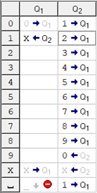
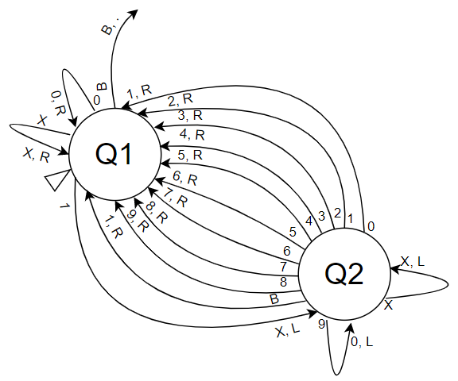
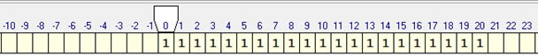
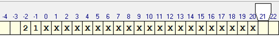

# Лабораторная работа №1
## Тема: построение машины Тьюринга

### Постановка задачи
Построить машину Тьюринга-Поста, решающую задачу перевода унарного кода в десятичный. Выполнить моделирование ее работы
в одном из свободно доступных симуляторов.
### Алфавит
0123456789X_
### Ход работы
Унарный код – способ представления чисел в виде последовательности единиц, количество которых равно представляемому
числу, например:  
610= 1111111.

Алгоритм перевода состоит из следующих шагов:
1. Поиск следующей единицы в унарной записи
2. Увеличение итогового десятичного числа, если единица найдена

Для реализации этого алгоритма с помощью машины Тьюринга определим два её состояния, соответствующие вышеописанным шагам
алгоритма:  
**Q1** — поиск следующей единицы  
**Q2** — увеличение десятичного числа

Таблица состояний в симуляторе приведена на рис. 1.

  
_Рис. 1. Таблица состояний._

С помощью инструментов сайта [draw.io](https://app.diagrams.net) составим диаграмму переходов (рис. 2).

  
_Рис. 2. Диаграмма переходов._

Для преобразования унарного кода необходимо подряд вписать каждую единицу в ячейки ленты и установить головку в ячейку
с первой единицей. Пример заполнения ленты для преобразования числа 21 приведён на рис. 3.

  
_Рис. 3. Начальное состояние ленты для преобразования унарного кода числа 21._

В процессе выполнения сначала мы доходим до следующей единицы унарного кода, заменяем её символом «X» для того, чтобы
выделить уже посещённые ячейки, и смещаемся влево до первой пустой ячейки или ячейки с цифрой. Если попадаем на пустую
ячейку, то заменяем её на «1», если на ячейку с цифрой – увеличиваем цифру на 1 (для увеличения числа, заканчивающегося
на «9», заменяем «9» на «0» и смещаемся влево), после чего переходим к поиску следующей единицы унарного кода и
повторяем описанные действия.

Останова машины происходит, когда в процессе поиска следующей единицы унарного кода мы попадаем на символ пробела,
т. е. когда обработаются все единицы унарного кода. Головка в этом случае останавливается на пробельном символе,
следующем за последней единицей унарного кода, а десятичная запись числа получается в ячейках, идущих перед той,
в которой была записана первая единица унарного кода. Пример данных на ленте после преобразования унарного кода
числа 21 приведён на рис. 4.

  
_Рис. 4. Состояние ленты после преобразования унарного кода числа 21._

### Вывод
В ходе выполнения лабораторной работы был реализован алгоритм перевода унарного кода в десятичный код на
машине Тьюринга. Для этого были определены состояния и переходы, визуализированные диаграммой и интерпретированные
в симуляторе машины Тьюринга. Для тестирования было выбрано представление числа 21 в унарном коде, и результат работы
машины оказался верным.